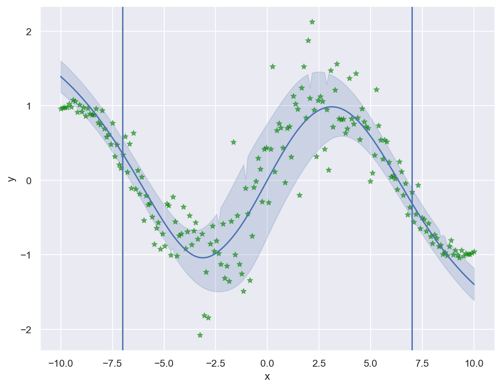
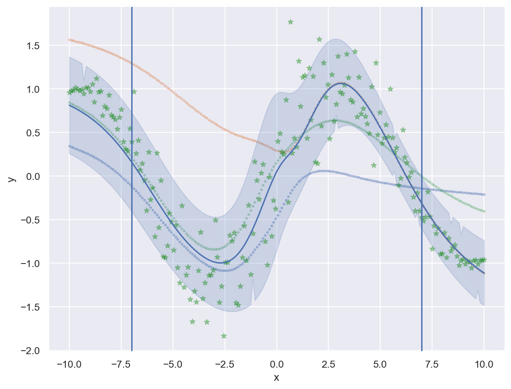
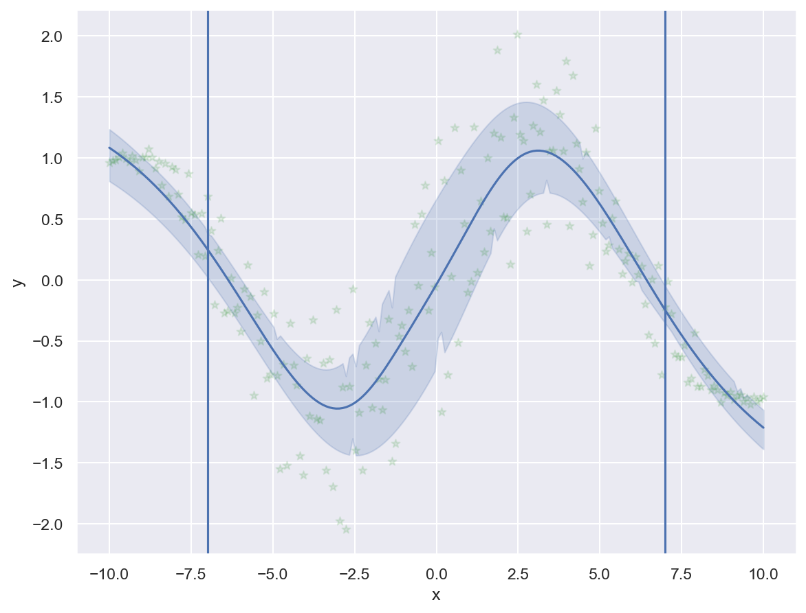
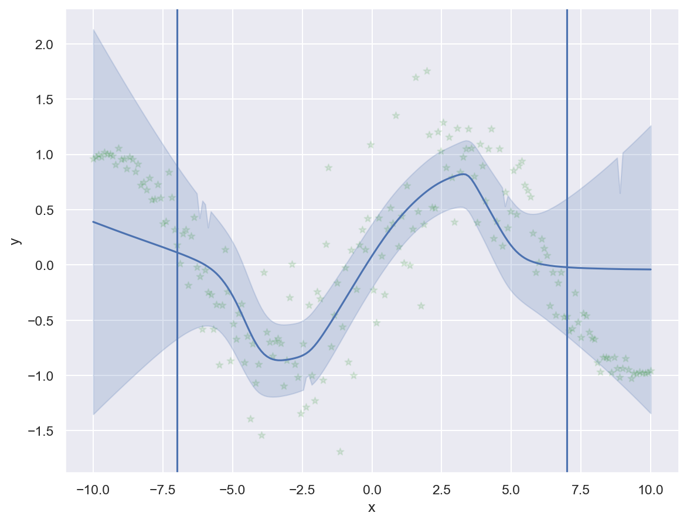
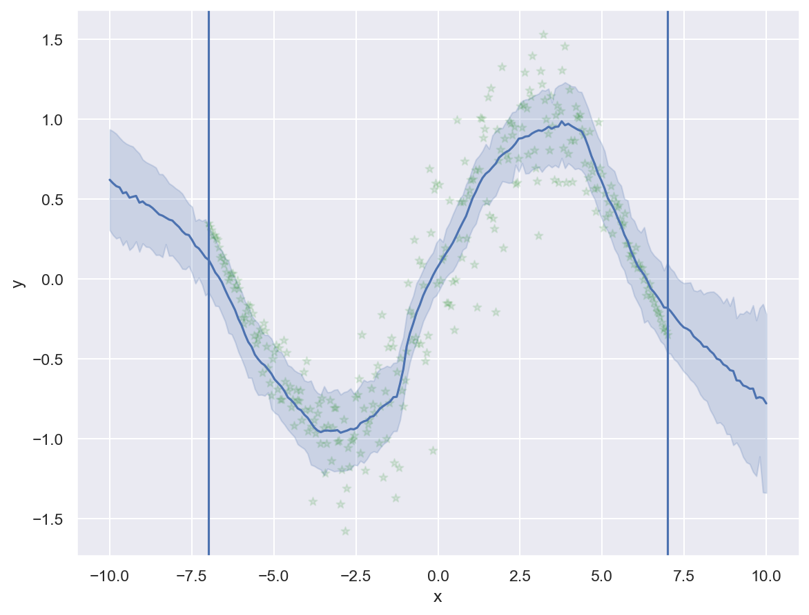
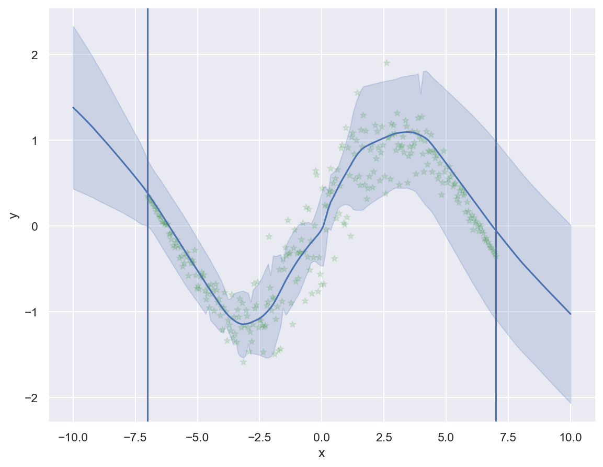

# Repository Summary

This repository contains original code implementations for various Deep Learning and Machine Learning algorithms for learning purposes.

- [Repository Summary](#repository-summary)
- [Deep Learning Uncertainty Estimation](#deep-learning-uncertainty-estimation)
  - [Useful resources](#useful-resources)
- [Deep Learning Architectures](#deep-learning-architectures)
- [Graph Neural Networks](#graph-neural-networks)
- [Machine Learning Architectures](#machine-learning-architectures)

# Deep Learning Uncertainty Estimation

This folder contains code for the following implementations of uncertainty estimation in deep learning models found in `~/dl_uncertainty`. Example implementations include `Gaussian`, `Gaussian Mixture`, `Quantile Regression`, `Bayesian`, `Monte Carlo Dropout` and `Ensemble`. Final test results are shown below with 95% confidence intervals.

Single Gaussian             |  Gaussian Mixture Model
:-------------------------:|:-------------------------:
  |  
Quantile Regression w/ `pinball_loss`            | Bayesian Neural Network
  |  
Monte Carlo Dropout           | Ensemble
  | 

## Useful resources
[Bayesian Methods for Hackers](https://rohanvarma.me/Regularization/)\
[Regularization as bayesian prior](https://rohanvarma.me/Regularization/)\
[Variational Inference Blogpost](http://krasserm.github.io/2019/03/14/bayesian-neural-networks/#appendix)

# Deep Learning Architectures

This repository contains original code implementations for the following implementations of deep learning architectures found in `/deep_learning`:
* **Multilayer Perceptrons**: logistic regression, logistic regression
* **Convolutional Neural Networks**: `batchnorm`, `adaptive lr`, `dropout`, `xavier`, `adam`, `alexnet`, `custom kernels`
*  **Recurrent Neural Networks**: `character rnn`, `word rnn`, `lstm`, `attention`
*  **Auto-Encoders**: `vanilla`, `variational`, `generative adversarial networks`

# Graph Neural Networks

# Machine Learning Architectures